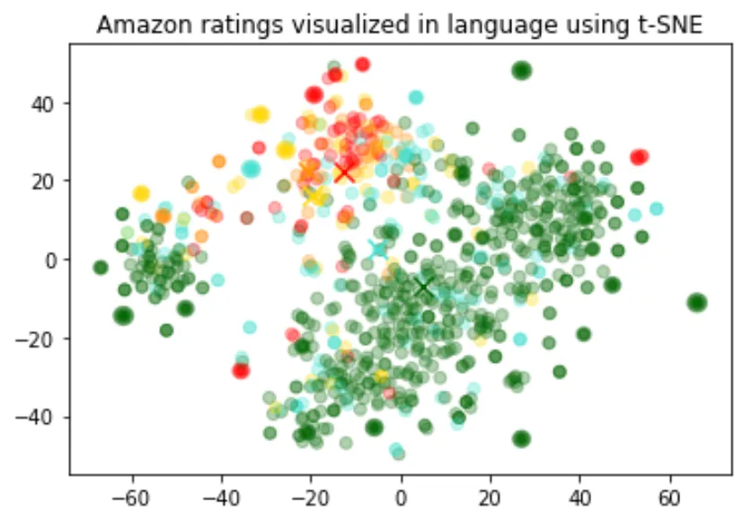

# 嵌入

OpenAI的文本嵌入（embeddings）可以测量文本字符串之间的相关性。嵌入通常用于：

* 搜索（结果按查询字符串的相关性排序）&#x20;
* 聚类（将文本字符串按相似性分组）&#x20;
* 推荐（推荐具有相关文本字符串的物品）&#x20;
* 异常检测（识别具有较少相关性的异常值）&#x20;
* 多样性测量（分析相似性分布）&#x20;
* 分类（将文本字符串按其最相似的标签分类）&#x20;

嵌入是由浮点数组成的向量（列表）。两个向量之间的距离可以衡量它们之间的相关性。小距离表明高相关性，大距离则表明低相关性。

请访问我们的[定价](https://openai.com/api/pricing/)页面了解嵌入的价格。请求基于输入中的token数量计费。

要了解嵌入的实际运用，请查看本文中的示例：

* 分类&#x20;
* 主题聚类
* 搜索
* 推荐

## 如何获取嵌入&#x20;

要获取嵌入，将您的文本字符串发送到嵌入API端点，并选择一个嵌入模型ID（例如text-embedding-ada-002）。响应将包含一个嵌入，您可以提取、保存和使用。

示例请求:


```shell
# 获取嵌入
curl https://api.openai.com/v1/embeddings \
  -H "Content-Type: application/json" \
  -H "Authorization: Bearer $OPENAI_API_KEY" \
  -d '{"input": "Your text string goes here",
       "model":"text-embedding-ada-002"}'
```

示例响应:

```
{
  "data": [
    {
      "embedding": [
        -0.006929283495992422,
        -0.005336422007530928,
        ...
        -4.547132266452536e-05,
        -0.024047505110502243
      ],
      "index": 0,
      "object": "embedding"
    }
  ],
  "model": "text-embedding-ada-002",
  "object": "list",
  "usage": {
    "prompt_tokens": 5,
    "total_tokens": 5
  }
}
```

在[OpenAI Cookbook](https://github.com/openai/openai-cookbook/)中查看更多Python代码示例。 使用OpenAI嵌入时，请记住它们的限制和风险。

## 嵌入模型

&#x20;OpenAI 提供了一个第二代嵌入模型（在模型 ID 中标记为 -002）和 16 个第一代模型（在模型 ID 中标记为 -001）。 我们建议几乎所有用例都使用 text-embedding-ada-002。它更好、更便宜、更简单易用。请阅读博客文章公告。

| 模型版本 | 分词器          | 最大输入词元 | 知识截止时间   |
| ---- | ------------ | ------ | -------- |
| V2   | cl100k\_base | 8191   | Sep 2021 |
| V1   | GPT-2/GPT-3  | 2046   | Aug 2020 |

使用按输入词元计价，每1000个词元的费率为0.0004美元，或者大约1美元可以翻译3000页（假设每页有800个词元）：

| 模型                     | 每美元的粗糙页面数 | BEIR 搜索评估的示例性能 |
| ---------------------- | --------- | -------------- |
| text-embedding-ada-002 | 3000      | 53.9           |
| _-davinci-_-001        | 6         | 52.8           |
| _-curie-_-001          | 60        | 50.9           |
| _-babbage-_-001        | 240       | 50.4           |
| _-ada-_-001            | 300       | 49.0           |

### 第二代模型

| 模型                     | 分词器          | 最大词元数 | 输出维度 |
| ---------------------- | ------------ | ----- | ---- |
| text-embedding-ada-002 | cl100k\_base | 8191  | 1536 |

### 第一代模型（不推荐）

官方也不推荐使用其他的第一代模型，这边就不翻译了

## 使用案例

这里我们展示一些代表性的使用案例。接下来的例子中，我们将使用[亚马逊美食评论数据集](https://www.kaggle.com/snap/amazon-fine-food-reviews)。

### 获取嵌入

该数据集包含截至2012年10月亚马逊用户留下的共568,454条食品评论。我们将使用最近1,000条评论的子集进行说明。这些评论是用英语编写的，往往是积极或消极的。每个评论都有一个ProductId、UserId、Score、评价标题（Summary）和评价正文（Text）。例如：

| 产品 ID      | 用户 ID          | 得分 | 总结     | 文本               |
| ---------- | -------------- | -- | ------ | ---------------- |
| B001E4KFG0 | A3SGXH7AUHU8GW | 5  | 优质狗粮   | 我已经买了几罐活力饮料...   |
| B00813GRG4 | A1D87F6ZCVE5NK | 1  | 不如广告所述 | 产品标签上写着巨型盐腌花生... |

我们将把评论摘要和评论文本合并成一个组合文本。模型将对这个组合文本进行编码，并输出一个单一的向量嵌入。

[Obtain\_dataset.ipynb](https://github.com/openai/openai-cookbook/blob/main/examples/Obtain\_dataset.ipynb)

```python
def get_embedding(text, model="text-embedding-ada-002"):
   text = text.replace("\n", " ")
   return openai.Embedding.create(input = [text], model=model)['data'][0]['embedding']
 
df['ada_embedding'] = df.combined.apply(lambda x: get_embedding(x, model='text-embedding-ada-002'))
df.to_csv('output/embedded_1k_reviews.csv', index=False)
```

要从保存的文件中加载数据，您可以运行以下命令：

```python
import pandas as pd
 
df = pd.read_csv('output/embedded_1k_reviews.csv')
df['ada_embedding'] = df.ada_embedding.apply(eval).apply(np.array)
```

### 数据2D可视化

[Visualizing\_embeddings\_in\_2D.ipynb](https://github.com/openai/openai-cookbook/blob/main/examples/Visualizing\_embeddings\_in\_2D.ipynb)

嵌入的大小取决于底层模型的复杂性。为了可视化这个高维数据，我们使用t-SNE算法将数据转换成二维。 我们根据评论者给出的星级评分来着色每个单独的评论：&#x20;

* 1星：红色&#x20;
* 2星：深橙色&#x20;
* 3星：金色&#x20;
* 4星：青绿色&#x20;
* 5星：深绿色



可视化似乎产生了大约3个聚类，其中一个主要是负面评价。

```python
import pandas as pd
from sklearn.manifold import TSNE
import matplotlib.pyplot as plt
import matplotlib
 
df = pd.read_csv('output/embedded_1k_reviews.csv')
matrix = df.ada_embedding.apply(eval).to_list()
 
# Create a t-SNE model and transform the data
tsne = TSNE(n_components=2, perplexity=15, random_state=42, init='random', learning_rate=200)
vis_dims = tsne.fit_transform(matrix)
 
colors = ["red", "darkorange", "gold", "turquiose", "darkgreen"]
x = [x for x,y in vis_dims]
y = [y for x,y in vis_dims]
color_indices = df.Score.values - 1
 
colormap = matplotlib.colors.ListedColormap(colors)
plt.scatter(x, y, c=color_indices, cmap=colormap, alpha=0.3)
plt.title("Amazon ratings visualized in language using t-SNE")
```

### 将嵌入作为文本特征编码器用于机器学习算法

[Regression\_using\_embeddings.ipynb](https://github.com/openai/openai-cookbook/blob/main/examples/Regression\_using\_embeddings.ipynb)

嵌入可以作为机器学习模型中通用的自由文本特征编码器。如果一些相关输入是自由文本，那么加入嵌入将提高任何机器学习模型的性能。嵌入也可以作为ML模型中分类特征编码器使用。如果分类变量名称有意义且数量众多（例如职位名称），则此方法最具价值。相似度嵌入通常比搜索嵌入在此任务上表现更好。&#x20;

我们观察到，通常情况下，嵌入表示的信息密度很高。例如，使用SVD或PCA降低输入维数即使只有10％，在特定任务的下游性能方面通常会导致更差的结果。

&#x20;该代码将数据分成训练集和测试集，并将被以下两个用例使用：回归和分类。

```python
from sklearn.model_selection import train_test_split
 
X_train, X_test, y_train, y_test = train_test_split(
    list(df.ada_embedding.values),
    df.Score,
    test_size = 0.2,
    random_state=42
)
```
